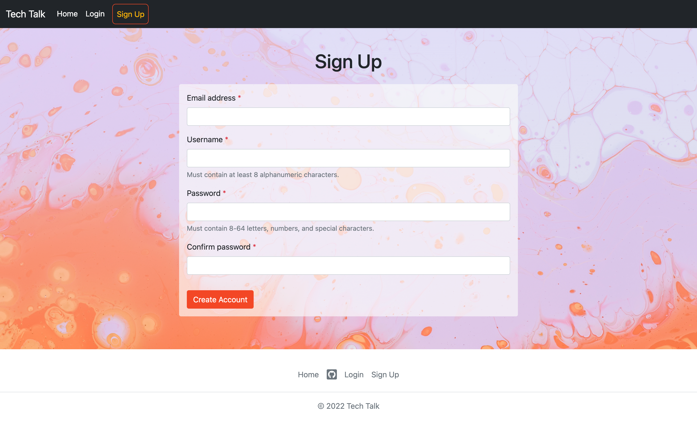
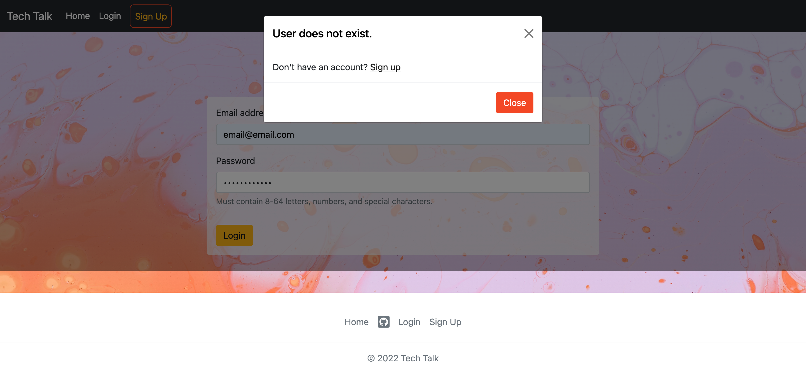

# Tech Talk | A Tech Blog CMS 

## Table of Contents

- [Description](#description)
  - [Technologies](#technologies)
  - [Deployed Application](#deployed-application)
- [Questions](#questions)
- [License](#license)
- [Screenshots](#screenshots)

## Description

A full-stack, CMS-style blog site featuring user-authentication, MVC structure, and Handlebars.js templating.

From their dashboard, authenticated users can view, edit, and delete their published blogs as well as write new ones. While logged in, users may also view and comment on others' blogs and return to edit or delete their comments. Unauthorized users may only view the blog titles, authors, and publish dates, but are able to easily sign up to access all features.

### Technologies

- Bootstrap & custom CSS
- Javascript & jQuery
- HTML & Handlebars.js
- Node.js
- Express.js server
- MySQL database
- Font Awesome

### Deployed Application

View the [live application]().

## Questions

To contribute to or ask questions about this project, please contact me via [email](mailto:kayle.patton22@gmail.com) or [GitHub](https://github.com/kayleriegerpatton).

## License

MIT License

## Screenshots

### Landing Page

### User Dashboard

### Signup Page

### Error Modal

